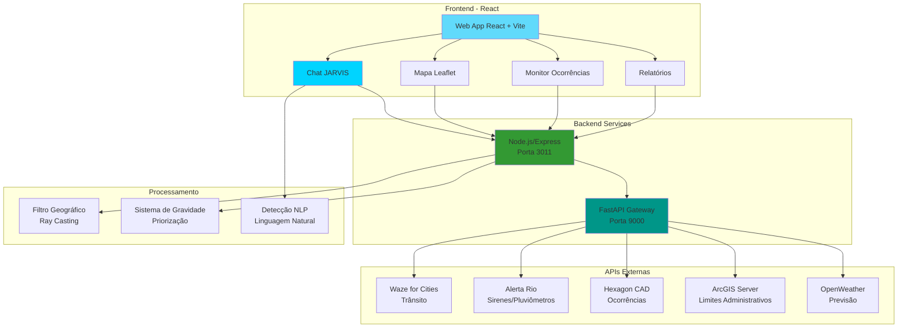
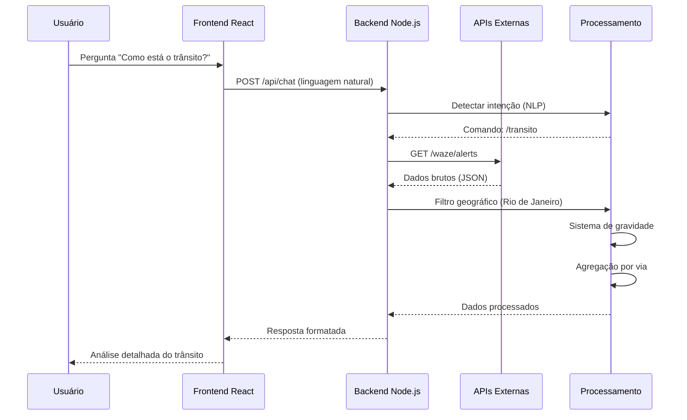

# 🤖 JARVIS Municipal Rio

<div align="center">


**Sistema Inteligente de Monitoramento e Gestão Municipal**  
*Defesa Civil do Rio de Janeiro*

[](LICENSE)
[](https://reactjs.org/)
[](https://nodejs.org/)
[](https://fastapi.tiangolo.com/)
[](https://github.com/mcoutinho2512/jarvis)

[🚀 Demo](#demo) • [📖 Documentação](#documentação) • [🛠️ Instalação](#instalação) • [🎯 Features](#features)

</div>

---

## 📋 Índice

- [Sobre o Projeto](#sobre-o-projeto)
- [Arquitetura do Sistema](#arquitetura-do-sistema)
- [Estrutura do Projeto](#estrutura-do-projeto)
- [Tecnologias Utilizadas](#tecnologias-utilizadas)
- [Features Principais](#features-principais)
- [Pré-requisitos](#pré-requisitos)
- [Instalação](#instalação)
- [Configuração](#configuração)
- [Uso](#uso)
- [APIs Integradas](#apis-integradas)
- [Componentes Principais](#componentes-principais)
- [Roadmap](#roadmap)
- [Contribuindo](#contribuindo)
- [Licença](#licença)
- [Contato](#contato)

---

## 🎯 Sobre o Projeto

**JARVIS Municipal Rio** é um sistema integrado de monitoramento e gestão de emergências desenvolvido para a **Defesa Civil do Rio de Janeiro**. O sistema agrega múltiplas fontes de dados em tempo real, proporcionando uma visão unificada e inteligente da situação municipal.

### 🌟 Diferenciais

- 🤖 **Assistente Inteligente (Chat JARVIS)** com processamento de linguagem natural
- 🗺️ **Mapa Interativo** com múltiplas camadas de dados georreferenciados
- 📊 **Análise em Tempo Real** de trânsito, clima, sirenes e ocorrências
- 🚨 **Sistema de Alertas Automáticos** baseado em criticidade
- 📈 **Relatórios Executivos** com métricas e rankings por região
- 🔄 **Integração Multi-API** (Waze, Alerta Rio, Hexagon CAD, ArcGIS)

---

## 🏗️ Arquitetura do Sistema



### 🔄 Fluxo de Dados



---

## 📁 Estrutura do Projeto

```
jarvis/
├── 📂 src/
│   ├── 📂 components/
│   │   ├── 🗺️ Map.jsx                          # Componente principal do mapa
│   │   ├── 📊 Relatorio.jsx                    # Geração de relatórios
│   │   ├── 🎨 useAdministrativeBoundaries.jsx  # Hook para limites municipais
│   │   └── 📦 [outros componentes]
│   │
│   ├── 🤖 ChatJarvis.jsx                       # Assistente inteligente
│   ├── 📱 App.jsx                              # Componente raiz
│   ├── 🔍 MonitorOcorrencias.jsx               # Monitor em tempo real
│   ├── 📄 RelatorioPage.jsx                    # Página de relatório completo
│   ├── 🎯 main.jsx                             # Entry point
│   └── 🎨 index.css                            # Estilos globais
│
├── 📂 public/
│   └── 📷 [assets, imagens, ícones]
│
├── 🔧 server.js                                # Backend Node.js/Express
├── 🚀 fastapi_gateway.py                       # Gateway FastAPI
├── 📝 package.json                             # Dependências Node.js
├── 📝 requirements.txt                         # Dependências Python
├── ⚙️ vite.config.js                          # Configuração Vite
├── 🎨 tailwind.config.js                       # Configuração Tailwind
├── 📋 .gitignore                               # Arquivos ignorados
└── 📖 README.md                                # Este arquivo

```

### 📦 Componentes Detalhados

```
src/
├── ChatJarvis.jsx              (1.037 linhas) - Assistente IA com NLP
├── Map.jsx                     (850+ linhas)  - Mapa interativo com camadas
├── App.jsx                     (400+ linhas)  - Roteamento e estado global
├── MonitorOcorrencias.jsx      (300+ linhas)  - Dashboard tempo real
└── RelatorioPage.jsx           (500+ linhas)  - Relatórios executivos
```

---

## 🛠️ Tecnologias Utilizadas

### Frontend


- **React 18.3.1** - Biblioteca UI
- **Vite 5.4** - Build tool e dev server
- **Tailwind CSS 4** - Framework CSS
- **Leaflet 1.9** - Mapas interativos
- **React Leaflet 4.2** - Integração Leaflet + React
- **Lucide React** - Ícones modernos

### Backend


- **Node.js 20.x** - Runtime JavaScript
- **Express 4.21** - Framework web
- **FastAPI 0.115** - API Gateway Python
- **Axios** - Cliente HTTP
- **CORS** - Segurança cross-origin

### Ferramentas


- **PM2** - Gerenciador de processos
- **Git** - Controle de versão
- **Ubuntu 24** - Sistema operacional

---

## ✨ Features Principais

### 🤖 Chat JARVIS - Assistente Inteligente

```javascript
// Suporte a linguagem natural
"Como está o trânsito?" → Análise detalhada
"Vai chover hoje?" → Previsão do tempo
"Tem alguma sirene tocando?" → Status das sirenes
"Qual a situação geral?" → Resumo executivo
```

**Comandos Disponíveis:**
- `/transito` - Análise avançada de trânsito com sistema de gravidade
- `/previsao` - Previsão do tempo Rio de Janeiro
- `/sirenes` - Status em tempo real das sirenes
- `/chuvas` - Monitoramento pluviométrico
- `/ocorrencias` - Ocorrências Hexagon CAD
- `/resumo` - Panorama geral da cidade
- `/status` - Status de todas as APIs
- `/ranking` - Ranking de bairros afetados
- `/ajuda` - Lista completa de comandos

### 🗺️ Mapa Interativo

**Camadas de Dados:**
- 🚨 **Sirenes Alerta Rio** (162 unidades)
  - 🟢 Online | 🔴 Acionadas | ⚫ Offline
- 💧 **Estações Pluviométricas** (33 estações)
  - Gradiente de cor por intensidade de chuva
- 🚗 **Alertas Waze** (filtrado geograficamente)
  - Acidentes, congestionamentos, vias fechadas
  - Ícones oficiais Waze
- 🏛️ **Limites Administrativos**
  - 166 bairros do Rio de Janeiro
  - Limite municipal

**Funcionalidades:**
- ✅ Filtros inteligentes por tipo e criticidade
- ✅ Tooltips informativos
- ✅ Auto-atualização (30s - 60s)
- ✅ Controles de camadas
- ✅ Zoom e navegação fluidos

### 📊 Sistema de Análise

**Análise de Trânsito:**
```
✅ Sistema de gravidade inteligente
✅ Priorização: Acidentes > Vias Fechadas > Congestionamentos
✅ Agregação por via com contagem de problemas
✅ Classificação de vias (Estrutural, Arterial, etc)
✅ Estatísticas com porcentagens
✅ Recomendações práticas
✅ Nível de criticidade automático
```

**Métricas Calculadas:**
- Total de alertas ativos
- Quantidade de acidentes
- Vias mais afetadas (Top 10)
- Tipos de incidentes mais comuns
- Nível de criticidade (Normal/Moderado/Alto/Crítico)

### 🚨 Sistema de Alertas

**Critérios de Criticidade:**
```python
CRÍTICO:    > 80 alertas OU > 3 acidentes
ALTO:       > 50 alertas OU > 1 acidente
MODERADO:   > 30 alertas
NORMAL:     < 30 alertas
```

**Notificações Automáticas:**
- Pop-ups para chuva forte (≥10mm/15min)
- Alertas de sirenes acionadas
- Ocorrências de alta prioridade

### 📈 Relatórios Executivos

**Relatório de Intempéries:**
- Ranking de bairros por criticidade
- Pontuação ponderada (sirenes + chuvas + ocorrências)
- Visualização por gráficos e tabelas
- Exportação em PDF/Excel

**Monitor de Ocorrências:**
- Dashboard em tempo real
- Filtros por prioridade e tipo
- Geolocalização de eventos
- Timeline de ocorrências

---

## 📋 Pré-requisitos

- **Node.js** >= 20.x
- **Python** >= 3.11
- **npm** ou **yarn**
- **Git**
- Servidor Ubuntu/Linux (recomendado)

---

## 🚀 Instalação

### 1️⃣ Clonar o Repositório

```bash
git clone https://github.com/mcoutinho2512/jarvis.git
cd jarvis
```

### 2️⃣ Instalar Dependências

**Frontend (Node.js):**
```bash
npm install
```

**Backend (Python):**
```bash
pip install -r requirements.txt --break-system-packages
```

### 3️⃣ Configurar Variáveis de Ambiente

Crie um arquivo `.env` na raiz do projeto:

```env
# APIs Externas
WAZE_API_KEY=sua_chave_waze
OPENWEATHER_API_KEY=sua_chave_openweather
HEXAGON_API_KEY=sua_chave_hexagon

# Configurações de Rede
FRONTEND_PORT=3013
BACKEND_PORT=3011
FASTAPI_PORT=9000

# URLs das APIs
ALERTA_RIO_API=https://api.alertario.rio.rj.gov.br
ARCGIS_SERVER=https://pgeo3.rio.rj.gov.br/arcgis/rest/services
```

---

## ⚙️ Configuração

### 🔧 Configurar Portas

**Frontend (Vite):**
```javascript
// vite.config.js
export default defineConfig({
  server: {
    port: 3013,
    host: '0.0.0.0',
    proxy: {
      '/api': {
        target: 'http://localhost:3011',
        changeOrigin: true
      }
    }
  }
})
```

**Backend (Node.js):**
```javascript
// server.js
const PORT = process.env.BACKEND_PORT || 3011;
app.listen(PORT, () => {
  console.log(`🚀 Servidor rodando em http://localhost:${PORT}`);
});
```

**Gateway (FastAPI):**
```python
# fastapi_gateway.py
if __name__ == "__main__":
    uvicorn.run(app, host="0.0.0.0", port=9000)
```

---

## 🎮 Uso

### Desenvolvimento Local

**Terminal 1 - Backend Node.js:**
```bash
cd ~/municipal-assistant
node server.js
```

**Terminal 2 - Gateway FastAPI:**
```bash
cd ~/municipal-assistant
python3 fastapi_gateway.py
```

**Terminal 3 - Frontend React:**
```bash
cd ~/municipal-assistant
npm run dev
```

### Produção com PM2

```bash
# Instalar PM2 globalmente
npm install -g pm2

# Iniciar todos os serviços
pm2 start server.js --name "jarvis-backend"
pm2 start "python3 fastapi_gateway.py" --name "jarvis-gateway"
pm2 start "npm run dev" --name "jarvis-frontend"

# Salvar configuração
pm2 save

# Configurar para iniciar no boot
pm2 startup
```

### Acessar o Sistema

```
Frontend:  http://localhost:3013
Backend:   http://localhost:3011/api
Gateway:   http://localhost:9000/docs
```

---

## 🔌 APIs Integradas

### 1. Waze for Cities API

**Endpoint:** `/api/waze/filtrado`

**Dados:**
- Alertas de trânsito em tempo real
- Tipos: Acidentes, congestionamentos, vias fechadas, perigos
- Filtro geográfico: Apenas Rio de Janeiro
- Atualização: 30 segundos

**Filtro Geográfico:**
```javascript
// Ray-casting algorithm para filtrar por município
function isPointInPolygon(point, polygon) {
  let inside = false;
  for (let i = 0, j = polygon.length - 1; i < polygon.length; j = i++) {
    const xi = polygon[i][1], yi = polygon[i][0];
    const xj = polygon[j][1], yj = polygon[j][0];
    
    const intersect = ((yi > point.lat) !== (yj > point.lat))
        && (point.lng < (xj - xi) * (point.lat - yi) / (yj - yi) + xi);
    if (intersect) inside = !inside;
  }
  return inside;
}
```

### 2. Alerta Rio API

**Endpoints:**
- `/api/sirenes` - Status das sirenes
- `/api/pluviometria` - Dados pluviométricos
- `/api/previsao` - Previsão do tempo

**Sirenes (162 unidades):**
```json
{
  "id": "string",
  "nome": "string",
  "bairro": "string",
  "online": boolean,
  "tocando": boolean,
  "lat": number,
  "lng": number,
  "ultimaAtualizacao": "datetime"
}
```

**Pluviômetros (33 estações):**
```json
{
  "estacao": "string",
  "bairro": "string",
  "chuva_15min": number,
  "chuva_1h": number,
  "chuva_4h": number,
  "lat": number,
  "lng": number
}
```

### 3. Hexagon CAD API

**Endpoint:** `/api/ocorrencias`

**Dados:**
- Ocorrências em andamento
- 53 tipos de incidentes (POP01-POP53)
- Prioridades: Muito Alta, Alta, Normal, Baixa
- Localização georreferenciada

**Tipos de Incidentes:**
```
POP01: Acidente de Trânsito
POP02: Alagamento
POP03: Deslizamento
POP04: Queda de Árvore
...
POP53: Outros
```

### 4. ArcGIS Server (Rio de Janeiro)

**Endpoint:** `https://pgeo3.rio.rj.gov.br/arcgis/rest/services`

**Camadas:**
- Limites de bairros (166 unidades)
- Limite municipal
- Regiões administrativas
- Áreas de risco

---

## 🧩 Componentes Principais

### ChatJarvis.jsx

**Responsabilidades:**
- Processamento de linguagem natural (NLP)
- Detecção de intenção do usuário
- Execução de comandos
- Formatação de respostas
- Histórico de conversas

**Funções Principais:**
```javascript
detectarIntencao(texto)       // NLP para identificar comando
processarComando(comando)     // Executar comando e buscar dados
enviarMensagem()              // Enviar pergunta do usuário
salvarConversa()              // Persistir histórico
```

### Map.jsx

**Responsabilidades:**
- Renderização do mapa Leaflet
- Gerenciamento de camadas
- Marcadores e popups
- Filtros e controles
- Auto-atualização de dados

**Hooks Personalizados:**
```javascript
useAdministrativeBoundaries() // Carregar limites municipais
useSirenes()                  // Gerenciar dados de sirenes
usePluviometros()             // Gerenciar dados de chuva
useWazeAlerts()               // Gerenciar alertas Waze
```

### MonitorOcorrencias.jsx

**Responsabilidades:**
- Dashboard de ocorrências em tempo real
- Filtros por tipo e prioridade
- Listagem com detalhes
- Estatísticas e métricas

### RelatorioPage.jsx

**Responsabilidades:**
- Geração de relatórios executivos
- Ranking de bairros
- Gráficos e visualizações
- Exportação de dados

---

## 🗺️ Roadmap

### ✅ Concluído

- [x] Mapa interativo com múltiplas camadas
- [x] Chat JARVIS com linguagem natural
- [x] Integração com APIs externas
- [x] Sistema de alertas automáticos
- [x] Análise inteligente de trânsito
- [x] Relatórios executivos
- [x] Monitor de ocorrências
- [x] Filtro geográfico preciso
- [x] Deploy em produção

### 🚧 Em Desenvolvimento

- [ ] Dashboard com gráficos Chart.js/Recharts
- [ ] Sistema de notificações push
- [ ] Análise preditiva com ML
- [ ] Histórico de eventos (banco de dados)
- [ ] API REST documentada (Swagger)

### 🔮 Futuro

- [ ] Versão mobile (PWA)
- [ ] Integração com câmeras ao vivo
- [ ] Autenticação e permissões
- [ ] Exportação de dados (Excel, CSV, JSON)
- [ ] Integração com WhatsApp/Telegram
- [ ] Sistema de tickets
- [ ] Análise de imagens com IA
- [ ] Previsão de enchentes

---

## 🤝 Contribuindo

Contribuições são bem-vindas! Siga os passos:

1. Fork o projeto
2. Crie uma branch para sua feature (`git checkout -b feature/AmazingFeature`)
3. Commit suas mudanças (`git commit -m 'feat: Add AmazingFeature'`)
4. Push para a branch (`git push origin feature/AmazingFeature`)
5. Abra um Pull Request

### 📝 Padrões de Commit

Seguimos o [Conventional Commits](https://www.conventionalcommits.org/):

```
feat: Nova funcionalidade
fix: Correção de bug
docs: Documentação
style: Formatação
refactor: Refatoração
test: Testes
chore: Manutenção
```

---

## 📄 Licença

Este projeto está sob a licença MIT. Veja o arquivo [LICENSE](LICENSE) para mais detalhes.

---

## 👥 Equipe

**Desenvolvido para:**  
🏛️ **Defesa Civil do Rio de Janeiro**

**Desenvolvido por:**  
👨‍💻 **Magnun Coutinho**  
📧 mcoutinho2512@gmail.com  
🐙 [github.com/mcoutinho2512](https://github.com/mcoutinho2512)

**Com apoio de:**  
🤖 **Claude AI** (Anthropic)

---

## 🙏 Agradecimentos

- **Waze for Cities** - Dados de trânsito em tempo real
- **Alerta Rio** - Sistema de Alerta e Monitoramento
- **Hexagon** - Sistema CAD de emergências
- **Prefeitura do Rio de Janeiro** - Dados abertos e APIs
- **OpenStreetMap** - Mapas base
- **Leaflet** - Biblioteca de mapas

---

## 📞 Contato e Suporte

**Issues:** [github.com/mcoutinho2512/jarvis/issues](https://github.com/mcoutinho2512/jarvis/issues)  
**Email:** mcoutinho2512@gmail.com  
**Documentação:** [Wiki do Projeto](https://github.com/mcoutinho2512/jarvis/wiki)

---

## 📊 Status do Projeto


![Up
